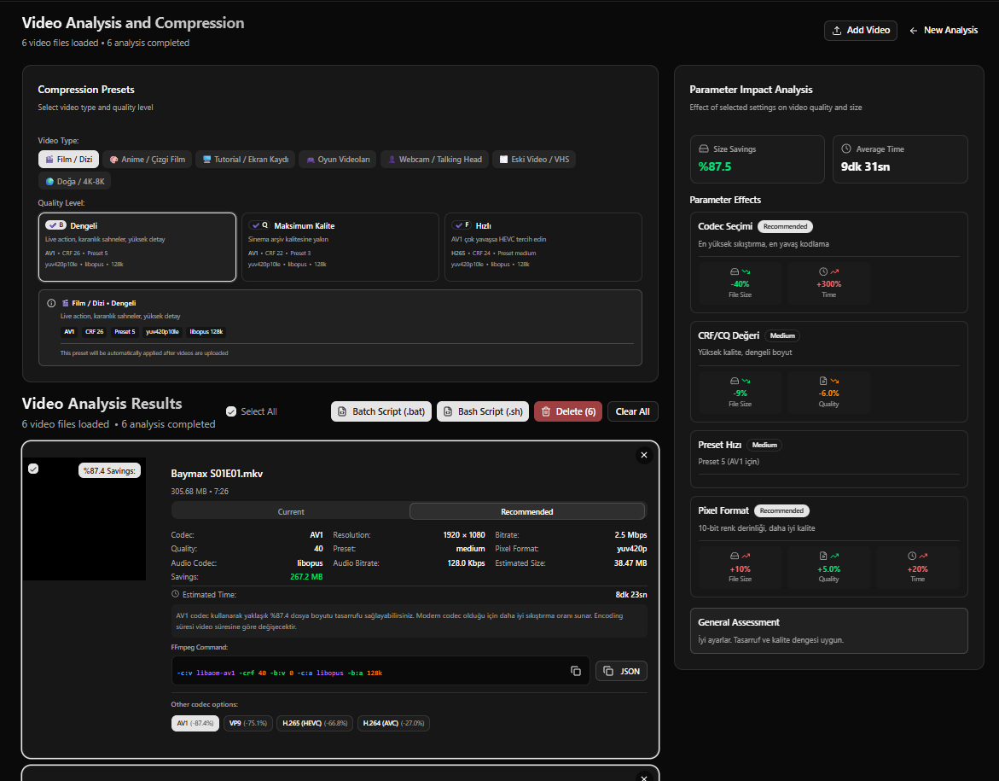

# 🎬 Video Compression Analyzer

<div align="center">



**A powerful, browser-based video compression analysis tool that helps you find optimal compression settings for your videos without uploading them anywhere.**

[](https://nextjs.org/)
[](https://www.typescriptlang.org/)
[](https://ffmpegwasm.netlify.app/)
[](https://react.dev/)
[](https://tailwindcss.com/)
[](https://opensource.org/licenses/MIT)

[English](#english) | [Türkçe](#türkçe)

</div>

---

## English

### 📖 About

**Video Compression Analyzer** is a fully client-side web application that analyzes your video files and provides optimal compression settings. All processing happens entirely in your browser using FFmpeg.wasm - your videos never leave your device, ensuring complete privacy and security.

### ✨ Features

- 🎥 **Advanced Video Analysis**: Extract comprehensive metadata using FFmpeg.wasm or HTML5 Video API fallback
- 📊 **Smart Compression Recommendations**: Get optimal codec, bitrate, CRF, and preset suggestions for each video
- 🔄 **Multi-Codec Support**: Analyze H.264, H.265 (HEVC), VP9, and AV1 codecs
- 🎨 **Preset System**: Choose from pre-configured presets for different video types (movies, anime, tutorials, gaming, etc.)
- 📈 **Parameter Impact Analysis**: Visualize how compression settings affect file size, quality, and encoding time
- 🎬 **Side-by-Side Video Comparison**: Compare two videos simultaneously with synchronized playback
- 💾 **100% Client-Side**: No server uploads, complete privacy
- 🌍 **Bilingual Support**: Full Turkish and English interface
- 🌙 **Dark Mode**: Automatic dark/light mode based on system preference
- 📱 **Responsive Design**: Works seamlessly on desktop, tablet, and mobile devices
- 🎯 **Batch Processing**: Generate batch scripts for multiple videos
- 📋 **FFmpeg Command Export**: Copy ready-to-use FFmpeg commands with syntax highlighting

### 🛠️ Technologies

- **Next.js 16** (App Router, Static Export)
- **TypeScript** - Type-safe development
- **React 19** - Modern UI framework
- **Tailwind CSS 4** - Utility-first styling
- **Shadcn UI** - Beautiful component library
- **FFmpeg.wasm** - Browser-based video processing
- **Zustand** - Lightweight state management
- **Framer Motion** - Smooth animations
- **React Dropzone** - Drag & drop file uploads

### 🚀 Quick Start

```bash
# Install dependencies
npm install

# Start development server
npm run dev

# Build for production
npm run build
```

The application will be available at `http://localhost:3000`

### 📦 Installation

1. Clone the repository:
```bash
git clone https://github.com/yourusername/video-compression-analyzer.git
cd video-compression-analyzer
```

2. Install dependencies:
```bash
npm install
```

3. Run the development server:
```bash
npm run dev
```

### 🎯 Usage

1. **Upload Videos**: Drag and drop video files or select a folder containing videos
2. **Select Preset** (Optional): Choose a compression preset based on your video type
3. **View Analysis**: Each video is automatically analyzed with recommendations for multiple codecs
4. **Compare Videos**: Select two videos and click "Compare" to view them side-by-side
5. **Copy Commands**: Use the generated FFmpeg commands to compress your videos
6. **Export Batch Scripts**: Generate Windows (.bat) or Linux/Mac (.sh) scripts for batch processing

### 📋 Supported Formats

- **Common**: MP4, AVI, MOV, MKV, WebM
- **Legacy**: FLV, WMV, M4V, 3GP
- **Broadcast**: TS, MTS, M2TS, VOB
- **Other**: OGV, ASF, RM, RMVB, DIVX, XVID

### 🎬 Codec Analysis

The tool analyzes and recommends four modern codecs:

- **H.264 (AVC)**: Widest compatibility, best for general use
- **H.265 (HEVC)**: Better compression, modern devices
- **VP9**: Open-source, web-optimized
- **AV1**: Latest standard, most efficient (future-proof)

### 📄 Project Structure

```
video-compression-analyzer/
├── src/
│   ├── app/              # Next.js pages
│   ├── components/        # React components
│   │   ├── navigation/   # Header, theme/language toggles
│   │   ├── video-analysis/ # Analysis page components
│   │   ├── video-comparison/ # Side-by-side comparison
│   │   ├── video-results/ # Result cards and grids
│   │   └── video-uploader/ # File upload components
│   └── lib/              # Utilities and core logic
│       ├── ffmpeg/       # FFmpeg integration
│       ├── i18n/         # Internationalization
│       ├── presets/      # Compression presets
│       ├── store/        # State management
│       └── utils/        # Helper functions
├── public/               # Static assets
└── image.png            # Project screenshot
```

### 🐳 Docker Deployment

### Using Docker Compose (Recommended)

```bash
# Build and start the container
docker-compose up -d

# View logs
docker-compose logs -f

# Stop the container
docker-compose down
```

The application will be available at `http://localhost:3000`

### Using Docker directly

```bash
# Build the image
docker build -t video-compression-analyzer .

# Run the container
docker run -p 3000:3000 video-compression-analyzer
```

### Docker Compose Features

- Automatic restart on failure
- Health checks
- Network isolation
- Production-ready configuration

## 🌐 Static Deployment

The application is fully static and can be deployed to any static hosting service:

- **Vercel** (Recommended)
- **Netlify**
- **GitHub Pages**
- **Any CDN**

```bash
npm run build
# Static files are generated in the 'out' directory
```

> *"Building browser-based video tools that respect your privacy - because your videos should never leave your device."*

---

## Türkçe

### 📖 Hakkında

**Video Sıkıştırma Analiz Aracı**, video dosyalarınızı analiz eden ve optimal sıkıştırma ayarları sunan tamamen tarayıcı tabanlı bir web uygulamasıdır. Tüm işlemler FFmpeg.wasm kullanılarak tarayıcınızda gerçekleşir - videolarınız cihazınızdan hiç çıkmaz, tam gizlilik ve güvenlik sağlanır.

### ✨ Özellikler

- 🎥 **Gelişmiş Video Analizi**: FFmpeg.wasm veya HTML5 Video API fallback kullanarak kapsamlı metadata çıkarma
- 📊 **Akıllı Sıkıştırma Önerileri**: Her video için optimal codec, bitrate, CRF ve preset önerileri
- 🔄 **Çoklu Codec Desteği**: H.264, H.265 (HEVC), VP9 ve AV1 codec'lerini analiz etme
- 🎨 **Preset Sistemi**: Farklı video türleri için önceden yapılandırılmış preset'ler (film, anime, eğitim, oyun vb.)
- 📈 **Parametre Etki Analizi**: Sıkıştırma ayarlarının dosya boyutu, kalite ve kodlama süresi üzerindeki etkisini görselleştirme
- 🎬 **Yan Yana Video Karşılaştırma**: İki videoyu senkronize oynatma ile birlikte karşılaştırma
- 💾 **%100 Client-Side**: Sunucuya yükleme yok, tam gizlilik
- 🌍 **İki Dilli Destek**: Tam Türkçe ve İngilizce arayüz
- 🌙 **Karanlık Mod**: Sistem tercihine göre otomatik karanlık/aydınlık mod
- 📱 **Responsive Tasarım**: Masaüstü, tablet ve mobil cihazlarda sorunsuz çalışır
- 🎯 **Toplu İşleme**: Birden fazla video için batch script'leri oluşturma
- 📋 **FFmpeg Komut Dışa Aktarma**: Syntax highlighting ile hazır FFmpeg komutlarını kopyalama

### 🛠️ Teknolojiler

- **Next.js 16** (App Router, Static Export)
- **TypeScript** - Tip güvenli geliştirme
- **React 19** - Modern UI framework
- **Tailwind CSS 4** - Utility-first stil sistemi
- **Shadcn UI** - Güzel component kütüphanesi
- **FFmpeg.wasm** - Tarayıcı tabanlı video işleme
- **Zustand** - Hafif state yönetimi
- **Framer Motion** - Akıcı animasyonlar
- **React Dropzone** - Sürükle-bırak dosya yükleme

### 🚀 Hızlı Başlangıç

```bash
# Bağımlılıkları yükle
npm install

# Geliştirme sunucusunu başlat
npm run dev

# Production build
npm run build
```

Uygulama `http://localhost:3000` adresinde kullanılabilir olacaktır.

### 📦 Kurulum

1. Repository'yi klonlayın:
```bash
git clone https://github.com/yourusername/video-compression-analyzer.git
cd video-compression-analyzer
```

2. Bağımlılıkları yükleyin:
```bash
npm install
```

3. Geliştirme sunucusunu çalıştırın:
```bash
npm run dev
```

### 🎯 Kullanım

1. **Video Yükleme**: Video dosyalarını sürükleyip bırakın veya video içeren bir klasör seçin
2. **Preset Seçme** (İsteğe Bağlı): Video türünüze göre bir sıkıştırma preset'i seçin
3. **Analiz Görüntüleme**: Her video otomatik olarak analiz edilir ve birden fazla codec için öneriler sunulur
4. **Video Karşılaştırma**: İki video seçin ve "Karşılaştır" butonuna tıklayarak yan yana görüntüleyin
5. **Komutları Kopyalama**: Oluşturulan FFmpeg komutlarını kullanarak videolarınızı sıkıştırın
6. **Batch Script Dışa Aktarma**: Toplu işleme için Windows (.bat) veya Linux/Mac (.sh) script'leri oluşturun

### 📋 Desteklenen Formatlar

- **Yaygın**: MP4, AVI, MOV, MKV, WebM
- **Eski**: FLV, WMV, M4V, 3GP
- **Yayın**: TS, MTS, M2TS, VOB
- **Diğer**: OGV, ASF, RM, RMVB, DIVX, XVID

### 🎬 Codec Analizi

Araç dört modern codec'i analiz eder ve önerir:

- **H.264 (AVC)**: En geniş uyumluluk, genel kullanım için en iyi
- **H.265 (HEVC)**: Daha iyi sıkıştırma, modern cihazlar
- **VP9**: Açık kaynak, web için optimize
- **AV1**: En yeni standart, en verimli (gelecek odaklı)

### 📄 Proje Yapısı

```
video-compression-analyzer/
├── src/
│   ├── app/              # Next.js sayfaları
│   ├── components/       # React component'leri
│   │   ├── navigation/  # Header, tema/dil toggle'ları
│   │   ├── video-analysis/ # Analiz sayfası component'leri
│   │   ├── video-comparison/ # Yan yana karşılaştırma
│   │   ├── video-results/ # Sonuç kartları ve grid'ler
│   │   └── video-uploader/ # Dosya yükleme component'leri
│   └── lib/              # Yardımcı fonksiyonlar ve core logic
│       ├── ffmpeg/      # FFmpeg entegrasyonu
│       ├── i18n/        # Uluslararasılaştırma
│       ├── presets/     # Sıkıştırma preset'leri
│       ├── store/       # State yönetimi
│       └── utils/       # Yardımcı fonksiyonlar
├── public/              # Statik dosyalar
└── image.png           # Proje ekran görüntüsü
```

### 🐳 Docker Deployment

### Docker Compose Kullanarak (Önerilen)

```bash
# Container'ı build et ve başlat
docker-compose up -d

# Logları görüntüle
docker-compose logs -f

# Container'ı durdur
docker-compose down
```

Uygulama `http://localhost:3000` adresinde kullanılabilir olacaktır.

### Docker ile Doğrudan

```bash
# Image'ı build et
docker build -t video-compression-analyzer .

# Container'ı çalıştır
docker run -p 3000:3000 video-compression-analyzer
```

### Docker Compose Özellikleri

- Hata durumunda otomatik yeniden başlatma
- Health check'ler
- Ağ izolasyonu
- Production-ready yapılandırma

## 🌐 Statik Deployment

Uygulama tamamen statiktir ve herhangi bir statik hosting servisine deploy edilebilir:

- **Vercel** (Önerilen)
- **Netlify**
- **GitHub Pages**
- **Herhangi bir CDN**

```bash
npm run build
# Statik dosyalar 'out' dizininde oluşturulur
```

> *"Gizliliğinize saygı duyan tarayıcı tabanlı video araçları geliştiriyorum - çünkü videolarınız cihazınızdan hiç çıkmamalı."*

---